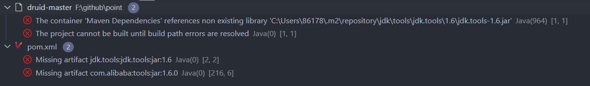
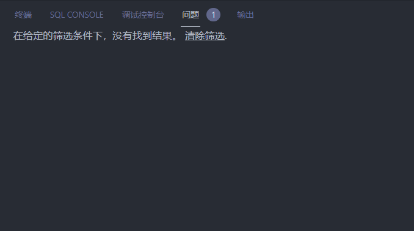

## windows



Missing artifact jdk.tools:jdk.tools:jar:1.6

jdk 9+ 没有 tools.jar这个文件。

去jdk8 lib 下找到，照着上面的错误，复制到相应的文件夹下。

然后maven里增加依赖

```xml
		<dependency>
			<groupId>jdk.tools</groupId>
			<artifactId>jdk.tools</artifactId>
			<version>1.6</version>
			<scope>system</scope>
			<systemPath>${JAVA_HOME}/lib/tools.jar</systemPath>
		</dependency>
```



