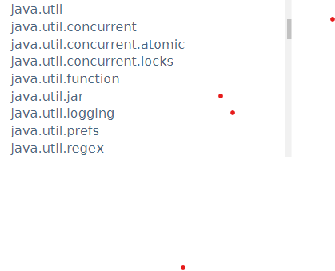
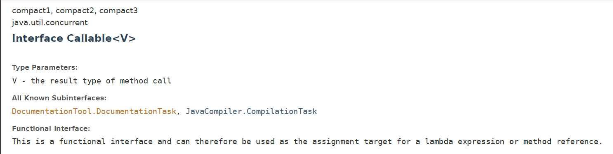
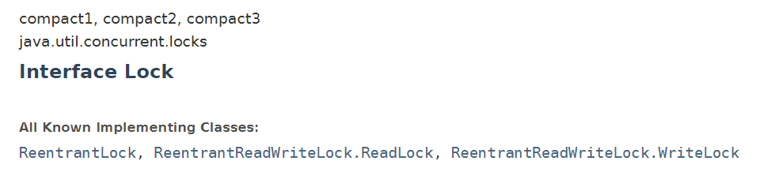

## 什么是juc

java.util 工具包，类



### 业务普通的线程代码 Thread






### 线程和进程

1. 进程：一个程序的集合，其中包含多个线程
2. java默认又2个线程
   1. main
   2. GC
3. 线程：可以写字，同时后台保存
   1. 可以使用 Thread Runnable Callable 开启多线程

#### java真的可以开启线程吗？

```java
	public synchronized void start() {
        /**
         * This method is not invoked for the main method thread or "system"
         * group threads created/set up by the VM. Any new functionality added
         * to this method in the future may have to also be added to the VM.
         *
         * A zero status value corresponds to state "NEW".
         */
        if (threadStatus != 0)
            throw new IllegalThreadStateException();

        /* Notify the group that this thread is about to be started
         * so that it can be added to the group's list of threads
         * and the group's unstarted count can be decremented. */
        group.add(this);

        boolean started = false;
        try {
            start0();
            started = true;
        } finally {
            try {
                if (!started) {
                    group.threadStartFailed(this);
                }
            } catch (Throwable ignore) {
                /* do nothing. If start0 threw a Throwable then
                  it will be passed up the call stack */
            }
        }
    }
	
	//这个方法会直接操作本地方法，c++，操作硬件
    private native void start0();
```


### 并发和并行

并发编程

并发：多线程同时操作同一个资源

1. CPU 一核 模拟多线程，快速交替

并行：

1. CPU 多核，多个线程同时处理

   ```java
   package com.hour;
   
   public class Test01 {
       public static void main(String[] args) {
           //获取 CPU 的核数
           //CPU 密集型 IO密集型
           System.out.println(Runtime.getRuntime().availableProcessors());
       }
   }
   ```

   并发编程的本质：**充分利用CPU性能**


### 线程的几个状态


```java
public enum State {

    	//新生
        NEW,
    
    	//运行
        RUNNABLE,
    
    	//阻塞
        BLOCKED,

    	//等待
        WAITING,
    
    	//超时等待
        TIMED_WAITING,

    	//终止
        TERMINATED;
    }
```

#### wait/sleep

- 来自不同的类
  - wait =》Object
  - sleep =》Thread
- wait 会释放锁，sleep 不会释放锁
- 范围不同
  - wait 必须在同步代码快中
  - sleep 可以在任何地方睡
- 是否需要捕获异常
  - wait 不需要捕获异常（终端异常）
  - sleep 需要捕获


## Lock锁

### 传统 synchronized

创建资源类

创建多个线程，使用资源类的操作方法

```java
package com.hour.learn02;

public class SaleTicket {
    public static void main(String[] args) {
        
        //资源对象
        Ticket t = new Ticket();
        
        //线程1
        Thread t1 = new Thread(new Runnable() {
            @Override
            public void run() {
                for (int i = 0; i < 5; i++) {
                    t.sale();
                    try {
                        Thread.sleep(100);
                    } catch (InterruptedException e) {
                        e.printStackTrace();
                    }
                }
            }
        });
		//线程2，lambda表达式写法
        Thread t2 = new Thread(
            () -> {
                for (int i = 0; i < 5; i++) {
                    t.sale();
                    try {
                        Thread.sleep(100);
                    } catch (InterruptedException e) {
                        e.printStackTrace();
                    }
                }
            }
        );

        t1.start();
        t2.start();
    }
}

// 资源类 OOP
class Ticket {

    private int number = 50;

    public synchronized void sale() {
        
            if (number > 0) {
                number--;
                System.out.println(Thread.currentThread().getName() + "剩余：" + number);
            } else {
                System.out.println("已售完");
            }
    }
}
```

在资源类操作方法

1. 判断
2. 干活
3. 通知

