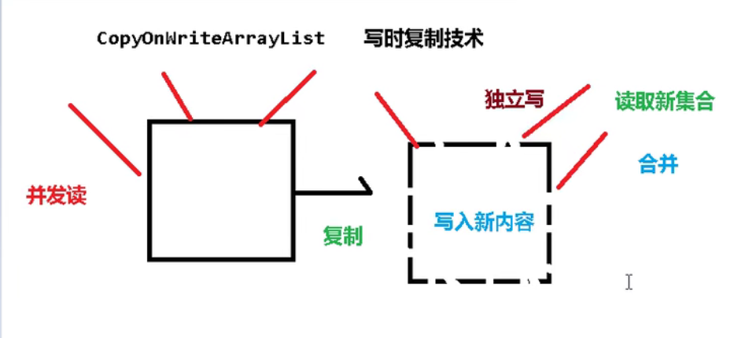

多线程向list中添加对象时，会发生异常

```java
package com.hour.list;

import java.util.ArrayList;
import java.util.List;
import java.util.UUID;

public class Array01 {
    public static void main(String[] args) {
        List<String> list = new ArrayList();
        for(int i = 0; i < 5; i ++){
            new Thread(
                () -> {
                    for(int j = 0; j < 5; j ++){
                        list.add(UUID.randomUUID().toString().substring(0,8));
                        System.out.println(list);
                        try {
                            Thread.sleep(10);
                        } catch (InterruptedException e) {
                            // TODO Auto-generated catch block
                            e.printStackTrace();
                        }
                    }
                    
                }
            , i + "").start();;
        }
    }
}

//===================================================================================

[3b99eae0, c469ebc4]
[3b99eae0, c469ebc4, fc58d41a, afb88622, cdf01a35]
Exception in thread "0" [3b99eae0, c469ebc4, fc58d41a, afb88622]
[3b99eae0, c469ebc4, fc58d41a]
-------------------------------------------------------------------------------
java.util.ConcurrentModificationException
        at java.util.ArrayList$Itr.checkForComodification(ArrayList.java:911)
        at java.util.ArrayList$Itr.next(ArrayList.java:861)
        at java.util.AbstractCollection.toString(AbstractCollection.java:461)
        at java.lang.String.valueOf(String.java:2994)
        at java.io.PrintStream.println(PrintStream.java:821)
        at com.hour.list.Array01.lambda$0(Array01.java:15)
        at java.lang.Thread.run(Thread.java:748)
-------------------------------------------------------------------------------
[3b99eae0, c469ebc4, fc58d41a, afb88622, cdf01a35, cf0b5f74]
[3b99eae0, c469ebc4, fc58d41a, afb88622, cdf01a35, cf0b5f74, bf3c7a10]
[3b99eae0, c469ebc4, fc58d41a, afb88622, cdf01a35, cf0b5f74, bf3c7a10, c5bd5ad9]
[3b99eae0, c469ebc4, fc58d41a, afb88622, cdf01a35, cf0b5f74, bf3c7a10, c5bd5ad9, 994f72ad]
...

```

## 解决方案

### Vector

```java
package com.hour.list;

import java.util.List;
import java.util.Random;
import java.util.Vector;

public class Vector01 {
    public static void main(String[] args) {
        Random r = new Random();
        
        List<Integer> list = new Vector<>();
        for(int i = 0; i < 5; i ++){
            new Thread(
                () -> {
                    for(int j = 0; j < 5; j ++){
                        list.add(r.nextInt(1000));
                        System.out.println(list);
                        try {
                            Thread.sleep(10);
                        } catch (InterruptedException e) {
                            // TODO Auto-generated catch block
                            e.printStackTrace();
                        }
                    }
                    
                }
            , i + "").start();
        }
    }
}

//========================================================================
[681]
[681, 83, 386, 660, 934]
[681, 83, 386, 660]
[681, 83]
[681, 83, 386]
[681, 83, 386, 660, 934, 135, 935]
[681, 83, 386, 660, 934, 135, 935, 907, 28, 649]
[681, 83, 386, 660, 934, 135, 935, 907, 28]
[681, 83, 386, 660, 934, 135, 935, 907, 28]
[681, 83, 386, 660, 934, 135, 935]
[681, 83, 386, 660, 934, 135, 935, 907, 28, 649, 453, 171]
[681, 83, 386, 660, 934, 135, 935, 907, 28, 649, 453, 171, 735]
[681, 83, 386, 660, 934, 135, 935, 907, 28, 649, 453, 171]
[681, 83, 386, 660, 934, 135, 935, 907, 28, 649, 453, 171, 735, 53, 833]
...

```


**原理：**

```java
	public synchronized void addElement(E obj) {
        modCount++;
        ensureCapacityHelper(elementCount + 1);
        elementData[elementCount++] = obj;
    }
```


### Collection

[Collections (Java Platform SE 8 ) (oracle.com)](https://docs.oracle.com/javase/8/docs/api/index.html)

```
synchronizedList(List<T> list)
```

**Returns a synchronized (thread-safe) list backed by the specified list.**

```java
package com.hour.list;

import java.util.Collections;
import java.util.ArrayList;
import java.util.List;
import java.util.Random;

public class Collection01 {
    public static void main(String[] args) {
        Random r = new Random();
        
        List<Integer> list = Collections.synchronizedList(new ArrayList());
        for(int i = 0; i < 5; i ++){
            new Thread(
                () -> {
                    for(int j = 0; j < 5; j ++){
                        list.add(r.nextInt(100));
                        System.out.println(list);
                        try {
                            Thread.sleep(10);
                        } catch (InterruptedException e) {
                            // TODO Auto-generated catch block
                            e.printStackTrace();
                        }
                    }
                    
                }
            , i + "").start();
        }
    }
}

```


### CopyOnWriteArrayList

```java
package com.hour.list;

import java.util.List;
import java.util.Random;
import java.util.concurrent.CopyOnWriteArrayList;

public class CoR {
    public static void main(String[] args) {
        Random r = new Random();
        
        List<Integer> list = new CopyOnWriteArrayList();
        for(int i = 0; i < 5; i ++){
            new Thread(
                () -> {
                    for(int j = 0; j < 5; j ++){
                        list.add(r.nextInt(1000));
                        System.out.println(list);
                        try {
                            Thread.sleep(10);
                        } catch (InterruptedException e) {
                            // TODO Auto-generated catch block
                            e.printStackTrace();
                        }
                    }
                    
                }
            , i + "").start();
        }
    }
}

```



```java
	//将指针指向新数组
	final void setArray(Object[] a) {
        array = a;
    }
    
    public boolean add(E e) {
        final ReentrantLock lock = this.lock;
        lock.lock();
        try {
            //获取原数组
            Object[] elements = getArray();
            int len = elements.length;
            //新数组
            Object[] newElements = Arrays.copyOf(elements, len + 1);
            newElements[len] = e;
            //指针
            setArray(newElements);
            return true;
        } finally {
            lock.unlock();
        }
    }
```

