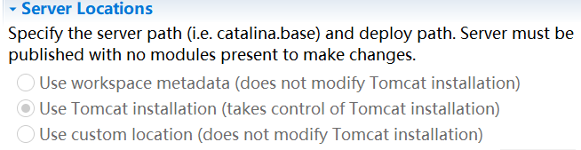

### web.xml放置于WEB-INF下

```xml
<?xml version="1.0" encoding="UTF-8"?>  
<web-app>  
	<servlet>  
	  <!-- 类名 -->  
	  <servlet-name>myServlet</servlet-name>  
	  <!-- 所在的包 -->  
	  <servlet-class>learn.myServlet</servlet-class>  
	</servlet>  
	<servlet-mapping>  
	  <servlet-name>myServlet</servlet-name>  
	  <!-- 访问的网址 -->  
	  <url-pattern>/my</url-pattern>
	</servlet-mapping> 
</web-app>
```

### 启动时应带上包名 /learn/myservlet

### 生成在webapps下



