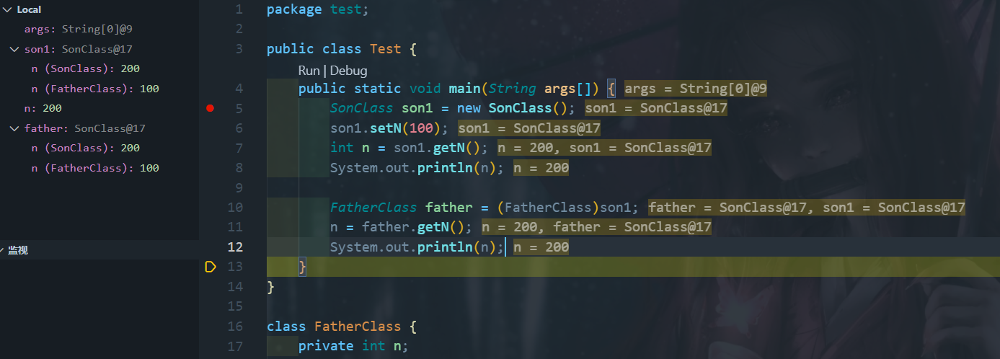

```java
public class Test {
	public static void main(String args[]) {
		SonClass son1 = new SonClass();
		son1.setN(100);
		int n = son1.getN();
		System.out.println(n);

		FatherClass father = (FatherClass)son1;
		n = father.getN();
		System.out.println(n);
	}
}

class FatherClass {
	private int n;

	FatherClass() {
		System.out.println("execute -> FatherClass()");
	}

	FatherClass(int n) {
		System.out.println("execute -> FatherClass(int n)");
		this.n = n;
	}

	void setN(int n) {
		System.out.println("execute -> FatherClass->setN");
		this.n = n;
	}

	int getN() {
		return this.n;
	}
}

// SubClass 类继承
class SonClass extends FatherClass {
	private int n;

	SonClass() { // 自动调用父类的无参数构造器
		System.out.println("execute -> SonClass");
	}

	public SonClass(int n) {
		super(300); // 调用父类中带有参数的构造器
		System.out.println("execute -> SonClass(int n):" + n);
		this.n = n;
	}

	@Override
	public void setN(int n) {
		super.setN(n);
		System.out.println("execute ->  SonClass -> setN");
		this.n = n + 100;
	}

	@Override
	public int getN() {
		System.out.println("execute -> SonClass -> getN");
		return this.n;
	}
}
```





私有属性无法被继承，子转父也无法获取父属性