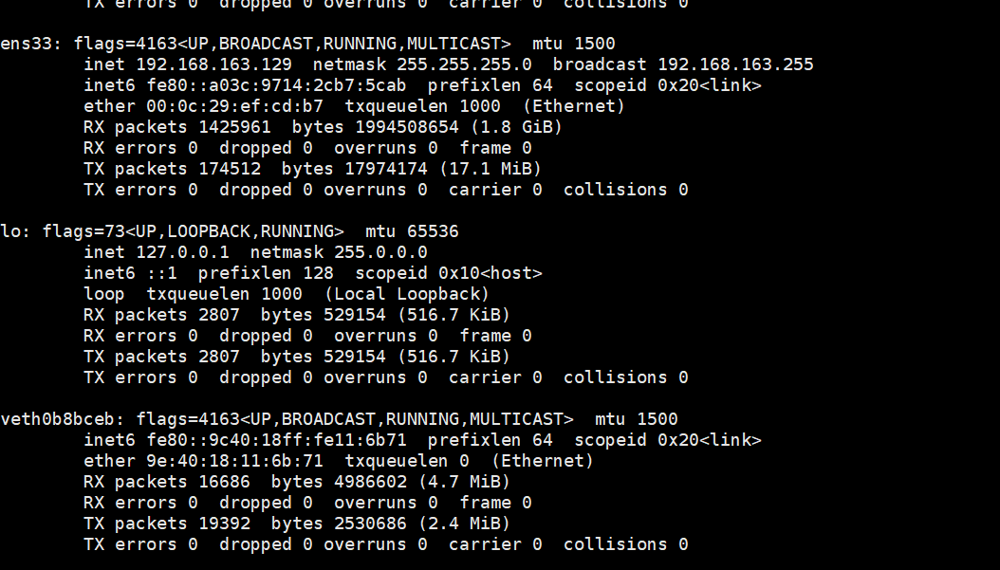

### 新建一个网络连接

```
docker network create -d macvlan --subnet=192.168.163.0/24 --gateway=192.168.163.2 -o parent=ens33 mynet
```

### subnet 是子网一般就是 xxx.xxx.xxx.0/24

### gateway 是网关 查看：

```
netstat -rn
Kernel IP routing table
Destination     Gateway         Genmask         Flags   MSS Window  irtt Iface
0.0.0.0         192.168.163.2   0.0.0.0         UG        0 0          0 ens33
172.17.0.0      0.0.0.0         255.255.0.0     U         0 0          0 docker0
192.168.163.0   0.0.0.0         255.255.255.0   U         0 0          0 ens33

```

### ens33 是要继承的，就是主机的IP所用的网卡

### 使用ifconfig查看



## 查看ip信息

```
docker inspect test
```

要看ipv4的，它和我指定的还不一样。

### run 容器时带上参数 

```
--net mynet --ip 192.168.163.101
```

```
"MacAddress": "",
            "Networks": {
                "mynet": {
                    "IPAMConfig": {
                        "IPv4Address": "192.168.163.3"
                    },
                    "Links": null,
                    "Aliases": [
                        "3aca914280d2"
                    ],
                    "NetworkID": "a10ec53a346660407ecdd7238df9bc16aec883e3f5c26746022deaad79e3cecc",
                    "EndpointID": "deb14208c6df645a1db5c9184b08486647df873a3d545593d13748661ff17e0f",
                    "Gateway": "192.168.163.2",
                    "IPAddress": "192.168.163.3",
                    "IPPrefixLen": 24,

```

获取到实际ip

发现 主机，其他虚拟机，都可ping通，但是宿主机却不行？？？？

```
docker network connect bridge test
```

再添加一个ip，即可正常通信

