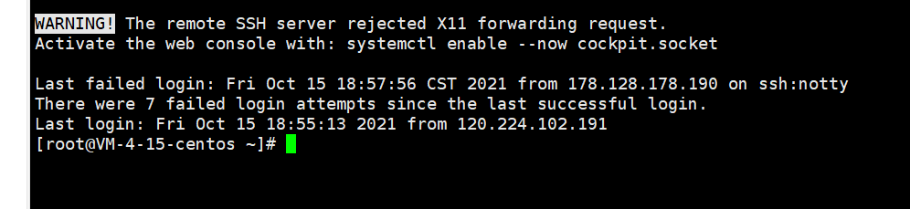
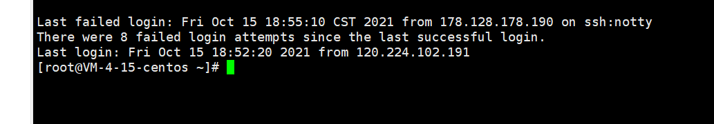
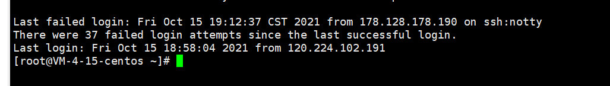

## centos7

允许通过某个ip登录

```
vim /etc/hosts.allow
```

可以编辑如下信息

```
sshd:192.168.92.133:allow  #允许 192.168.0.1 这个 IP 地址 ssh 登录
sshd:192.168.92.0/24:allow #允许 192.168.92.0/24 这段 IP 地址的用户登录
sshd:ALL # 允许全部的 ip通过ssh 登录 
```

也可以限制从某ip登录

```
vim /etc/hosts.deny
```

可以编辑如下信息

```
sshd:192.168.92.135:deny #拒绝135这个IP地址通过ssh登录
sshd:all:deny    #拒绝所欲sshd远程连接
```

## centos 8

```
修改 vi /etc/ssh/sshd_config
DenyUsers *@54.168.21.21
DenyUsers *@18.68.66.88
```

