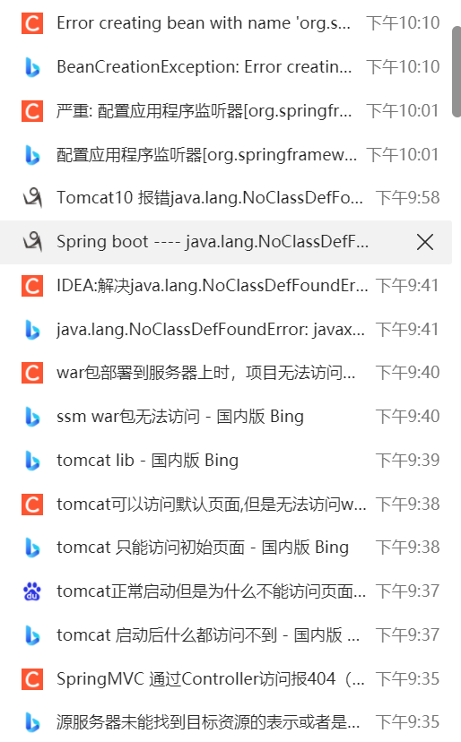

高版本jdk没有javax.annotation（我明明用的就是jdk1.8...）

```xml
  <dependency>
    <groupId>javax.annotation</groupId>
    <artifactId>jsr250-api</artifactId>
    <version>1.0</version>
  </dependency>
```


更新一下对应jar包就好了，相应的jar包也要注意版本相对应

```
org.springframework.beans.factory.BeanCreationException: Error creating bean with name 'org.springframework.web.servlet.mvc.method.annotation.RequestMappingHandlerAdapter': Instantiation of bean failed; nested exception is org.springframework.beans.BeanInstantiationException: Failed to instantiate [org.springframework.web.servlet.mvc.method.annotation.RequestMappingHandlerAdapter]: Constructor threw exception; nested exception is java.lang.NoClassDefFoundError: com/fasterxml/jackson/core/util/JacksonFeature
	org.springframework.beans.factory.support.AbstractAutowireCapableBeanFactory.instantiateBean(AbstractAutowireCapableBeanFactory.java:1320)
	org.springframework.beans.factory.support.AbstractAutowireCapableBeanFactory.createBeanInstance(AbstractAutowireCapableBeanFactory.java:1214)
	org.springframework.beans.factory.support.AbstractAutowireCapableBeanFactory.doCreateBean(AbstractAutowireCapableBeanFactory.java:557)
	org.springframework.beans.factory.support.AbstractAutowireCapableBeanFactory.createBean(AbstractAutowireCapableBeanFactory.java:517)
	org.springframework.beans.factory.support.AbstractBeanFactory.lambda$doGetBean$0(AbstractBeanFactory.java:323)
	org.springframework.beans.factory.support.DefaultSingletonBeanRegistry.getSingleton(DefaultSingletonBeanRegistry.java:222)
	org.springframework.beans.factory.support.AbstractBeanFactory.doGetBean(AbstractBeanFactory.java:321)
	org.springframework.beans.factory.support.AbstractBeanFactory.getBean(AbstractBeanFactory.java:202)
	org.springframework.beans.factory.support.DefaultListableBeanFactory.preInstantiateSingletons(DefaultListableBeanFactory.java:882)
	org.springframework.context.support.AbstractApplicationContext.finishBeanFactoryInitialization(AbstractApplicationContext.java:878)
	org.springframework.context.support.AbstractApplicationContext.refresh(AbstractApplicationContext.java:550)
	org.springframework.web.servlet.FrameworkServlet.configureAndRefreshWebApplicationContext(FrameworkServlet.java:702)
	org.springframework.web.servlet.FrameworkServlet.createWebApplicationContext(FrameworkServlet.java:668)
	org.springframework.web.servlet.FrameworkServlet.createWebApplicationContext(FrameworkServlet.java:716)
	org.springframework.web.servlet.FrameworkServlet.initWebApplicationContext(FrameworkServlet.java:591)
	org.springframework.web.servlet.FrameworkServlet.initServletBean(FrameworkServlet.java:530)
	org.springframework.web.servlet.HttpServletBean.init(HttpServletBean.java:170)
	javax.servlet.GenericServlet.init(GenericServlet.java:158)
	org.apache.catalina.authenticator.AuthenticatorBase.invoke(AuthenticatorBase.java:544)
	org.apache.catalina.valves.ErrorReportValve.invoke(ErrorReportValve.java:81)
	org.apache.catalina.valves.AbstractAccessLogValve.invoke(AbstractAccessLogValve.java:698)
	org.apache.catalina.connector.CoyoteAdapter.service(CoyoteAdapter.java:364)
	org.apache.coyote.http11.Http11Processor.service(Http11Processor.java:624)
	org.apache.coyote.AbstractProcessorLight.process(AbstractProcessorLight.java:65)
	org.apache.coyote.AbstractProtocol$ConnectionHandler.process(AbstractProtocol.java:831)
	org.apache.tomcat.util.net.NioEndpoint$SocketProcessor.doRun(NioEndpoint.java:1650)
	org.apache.tomcat.util.net.SocketProcessorBase.run(SocketProcessorBase.java:49)
	org.apache.tomcat.util.threads.ThreadPoolExecutor.runWorker(ThreadPoolExecutor.java:1191)
	org.apache.tomcat.util.threads.ThreadPoolExecutor$Worker.run(ThreadPoolExecutor.java:659)
	org.apache.tomcat.util.threads.TaskThread$WrappingRunnable.run(TaskThread.java:61)
	java.base/java.lang.Thread.run(Thread.java:831)
```


sql没有设默认值

数据库id设为`自增`

```
java.sql.SQLException: Field 'id' doesn't have a default value
	com.mysql.cj.jdbc.exceptions.SQLError.createSQLException(SQLError.java:129)
	com.mysql.cj.jdbc.exceptions.SQLExceptionsMapping.translateException(SQLExceptionsMapping.java:122)
	com.mysql.cj.jdbc.ClientPreparedStatement.executeInternal(ClientPreparedStatement.java:953)
	com.mysql.cj.jdbc.ClientPreparedStatement.execute(ClientPreparedStatement.java:370)
	com.alibaba.druid.pool.DruidPooledPreparedStatement.execute(DruidPooledPreparedStatement.java:498)
	org.apache.ibatis.executor.statement.PreparedStatementHandler.update(PreparedStatementHandler.java:47)
	org.apache.ibatis.executor.statement.RoutingStatementHandler.update(RoutingStatementHandler.java:74)
	org.apache.ibatis.executor.SimpleExecutor.doUpdate(SimpleExecutor.java:50)
	org.apache.ibatis.executor.BaseExecutor.update(BaseExecutor.java:117)
	org.apache.ibatis.executor.CachingExecutor.update(CachingExecutor.java:76)
	org.apache.ibatis.session.defaults.DefaultSqlSession.update(DefaultSqlSession.java:194)
	org.apache.ibatis.session.defaults.DefaultSqlSession.insert(DefaultSqlSession.java:181)
	java.base/jdk.internal.reflect.NativeMethodAccessorImpl.invoke0(Native Method)
	java.base/jdk.internal.reflect.NativeMethodAccessorImpl.invoke(NativeMethodAccessorImpl.java:78)
	java.base/jdk.internal.reflect.DelegatingMethodAccessorImpl.invoke(DelegatingMethodAccessorImpl.java:43)
	java.base/java.lang.reflect.Method.invoke(Method.java:567)
	org.mybatis.spring.SqlSessionTemplate$SqlSessionInterceptor.invoke(SqlSessionTemplate.java:433)
	jdk.proxy3/jdk.proxy3.$Proxy15.insert(Unknown Source)
	org.mybatis.spring.SqlSessionTemplate.insert(SqlSessionTemplate.java:278)
	org.apache.ibatis.binding.MapperMethod.execute(MapperMethod.java:62)
	org.apache.ibatis.binding.MapperProxy$PlainMethodInvoker.invoke(MapperProxy.java:145)
	org.apache.ibatis.binding.MapperProxy.invoke(MapperProxy.java:86)
	jdk.proxy3/jdk.proxy3.$Proxy16.insertStudent(Unknown Source)
	com.hour.service.impl.StudentServiceImpl.addStudent(StudentServiceImpl.java:20)
	com.hour.controller.StudentController.addStudent(StudentController.java:27)
	java.base/jdk.internal.reflect.NativeMethodAccessorImpl.invoke0(Native Method)
	java.base/jdk.internal.reflect.NativeMethodAccessorImpl.invoke(NativeMethodAccessorImpl.java:78)
	java.base/jdk.internal.reflect.DelegatingMethodAccessorImpl.invoke(DelegatingMethodAccessorImpl.java:43)
	java.base/java.lang.reflect.Method.invoke(Method.java:567)
	org.springframework.web.method.support.InvocableHandlerMethod.doInvoke(InvocableHandlerMethod.java:190)
	org.springframework.web.method.support.InvocableHandlerMethod.invokeForRequest(InvocableHandlerMethod.java:138)
	org.springframework.web.servlet.mvc.method.annotation.ServletInvocableHandlerMethod.invokeAndHandle(ServletInvocableHandlerMethod.java:105)
	org.springframework.web.servlet.mvc.method.annotation.RequestMappingHandlerAdapter.invokeHandlerMethod(RequestMappingHandlerAdapter.java:879)
	org.springframework.web.servlet.mvc.method.annotation.RequestMappingHandlerAdapter.handleInternal(RequestMappingHandlerAdapter.java:793)
	org.springframework.web.servlet.mvc.method.AbstractHandlerMethodAdapter.handle(AbstractHandlerMethodAdapter.java:87)
	org.springframework.web.servlet.DispatcherServlet.doDispatch(DispatcherServlet.java:1040)
	org.springframework.web.servlet.DispatcherServlet.doService(DispatcherServlet.java:943)
	org.springframework.web.servlet.FrameworkServlet.processRequest(FrameworkServlet.java:1006)
	org.springframework.web.servlet.FrameworkServlet.doPost(FrameworkServlet.java:909)
	javax.servlet.http.HttpServlet.service(HttpServlet.java:681)
	org.springframework.web.servlet.FrameworkServlet.service(FrameworkServlet.java:883)
	javax.servlet.http.HttpServlet.service(HttpServlet.java:764)
	org.apache.tomcat.websocket.server.WsFilter.doFilter(WsFilter.java:52)
	org.springframework.web.filter.CharacterEncodingFilter.doFilterInternal(CharacterEncodingFilter.java:201)
	org.springframework.web.filter.OncePerRequestFilter.doFilter(OncePerRequestFilter.java:119)
```

