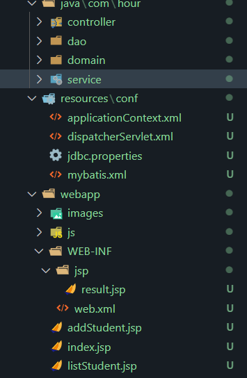

### 使用maven快速构建一个java8普通项目

### 引入依赖

```xml
	<!--servlet依赖-->
    <dependency>
      <groupId>javax.servlet</groupId>
      <artifactId>javax.servlet-api</artifactId>
      <version>3.1.0</version>
      <scope>provided</scope>
    </dependency>
    <!-- jsp依赖 -->
    <dependency>
      <groupId>javax.servlet.jsp</groupId>
      <artifactId>jsp-api</artifactId>
      <version>2.2.1-b03</version>
      <scope>provided</scope>
    </dependency>
    <dependency>
      <groupId>org.springframework</groupId>
      <artifactId>spring-webmvc</artifactId>
      <version>5.2.5.RELEASE</version>
    </dependency>
    <dependency>
      <groupId>org.springframework</groupId>
      <artifactId>spring-tx</artifactId>
      <version>5.2.5.RELEASE</version>
    </dependency>
    <dependency>
      <groupId>org.springframework</groupId>
      <artifactId>spring-jdbc</artifactId>
      <version>5.2.5.RELEASE</version>
    </dependency>
    <dependency>
      <groupId>com.fasterxml.jackson.core</groupId>
      <artifactId>jackson-core</artifactId>
      <version>2.9.0</version>
    </dependency>
    <dependency>
      <groupId>com.fasterxml.jackson.core</groupId>
      <artifactId>jackson-databind</artifactId>
      <version>2.13.0-rc2</version>
    </dependency>
    <dependency>
      <groupId>org.mybatis</groupId>
      <artifactId>mybatis-spring</artifactId>
      <version>1.3.1</version>
    </dependency>
    <dependency>
      <groupId>org.mybatis</groupId>
      <artifactId>mybatis</artifactId>
      <version>3.5.7</version>
    </dependency>
    <dependency>
      <groupId>mysql</groupId>
      <artifactId>mysql-connector-java</artifactId>
      <version>8.0.26</version>
    </dependency>
    <dependency>
      <groupId>com.alibaba</groupId>
      <artifactId>druid</artifactId>
      <version>1.1.12</version>
    </dependency>
```

### 资源文件

```xml
<build>
	<resources>
      <resource>
        <directory>src/main/java</directory><!--所在的目录-->
        <includes><!--包括目录下的.properties,.xml 文件都会扫描到-->
          <include>**/*.properties</include>
          <include>**/*.xml</include>
        </includes>
        <filtering>false</filtering>
      </resource>
    </resources>
    <resource>
        <directory>src/main/resources</directory><!--所在的目录-->
      </resource>
      <resource>
        <directory>src/main/webapp</directory><!--所在的目录-->
      </resource>
...
```

### 创建配置文件

conf目录下新建

applicationContext.xml

dispatcherServlet.xml

jdbc.properties

mybatis.xml

### 插件war

```xml
	<plugins>
      <plugin>  
        <artifactId>maven-war-plugin</artifactId>   
        <version>2.0.2</version>
      </plugin>
    </plugins>
```


### 代码



