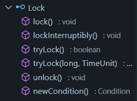

### Lock是一个接口



### Sync 抽象类

#### FairSync 和 NonfairSync 子类

可重入锁构造方法

```java
 	public ReentrantLock() {
        sync = new NonfairSync();
    }

    /**
     * Creates an instance of {@code ReentrantLock} with the
     * given fairness policy.
     *
     * @param fair {@code true} if this lock should use a fair ordering policy
     */
    public ReentrantLock(boolean fair) {
        sync = fair ? new FairSync() : new NonfairSync();
    }
```

默认非公平锁 lock 下的锁具有阻塞和唤醒功能

### Sync 父类 AbstractQueuedSynchronizer （AQS） 队列同步器

### 锁的实现原理

1. 一个 `state` 变量标记该锁的状态。至少有两个值，对 state 变量操作要求安全，就会用到CAS
2. 记录当前哪个线程拥有锁
3. 底层支持一个对线程的阻塞或唤醒操作
4. 用一个队列维护所有阻塞的线程，这个队列也必须是线程安全的队列

```java
	/**
     * The current owner of exclusive mode synchronization.
     */
    private transient Thread exclusiveOwnerThread;
```

```java
	/**
     * The synchronization state.
     */
    private volatile int state;
```

state = 0， 没有线程持有锁

state = 1，有一个线程持有锁

state > 1，线程重入了锁


### AQS

在AQS中，实现了一个阻塞队列

```java
	/** CLH Nodes */
    abstract static class Node {
        volatile Node prev;       // initially attached via casTail
        volatile Node next;       // visibly nonnull when signallable
        Thread waiter;            // visibly nonnull when enqueued
        volatile int status;      // written by owner, atomic bit ops by others
    }
```

```java
	/**
     * Head of the wait queue, lazily initialized.
     */
    private transient volatile Node head;

    /**
     * Tail of the wait queue. After initialization, modified only via casTail.
     */
    private transient volatile Node tail;
```

