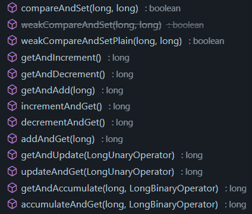

### AtomicInteger 和 AtominLong

使用 CAS 乐观锁，性能要好于 `synchronized`

CAS：compare and set

### AtomicBoolean 和 AtominReference

```java
if(flag == false) {
	flag = true;
}
```

```java
if(compareAndSet(false, true)) {
	...
}
```

### 实现

Unsafe 类中只提供了三种 CAS 操作 int， long， Object

double 通过和 long 转换来实现（DoubleAdder）

### ABA问题

CAS操作时，值先变为了另一个值，有改了回来，这个时候无法识别是否被更改过

所以要加上一个版本号

### 使用AtomicStampedRefence

```java
 /**
     * Atomically sets the value of both the reference and stamp
     * to the given update values if the
     * current reference is {@code ==} to the expected reference
     * and the current stamp is equal to the expected stamp.
     *
     * @param expectedReference the expected value of the reference
     * @param newReference the new value for the reference
     * @param expectedStamp the expected value of the stamp
     * @param newStamp the new value for the stamp
     * @return {@code true} if successful
     */
    public boolean compareAndSet(V   expectedReference,
                                 V   newReference,
                                 int expectedStamp,
                                 int newStamp) {
        Pair<V> current = pair;
        return
            expectedReference == current.reference &&
            expectedStamp == current.stamp &&
            ((newReference == current.reference &&
              newStamp == current.stamp) ||
             casPair(current, Pair.of(newReference, newStamp)));
    }
```

### AtomicMarkableReference

和上面一样，只不过版本号是false和true两个版本

### AtomicIntegerFieldUpdater

如果一个类是自己写的，可以直接用上面的，但是如果是已经写好的类。

想要加强实现功能，

### LongAdder

AtomicLong 内部是一个 volatile long变量，由多个线程对这个变量进行CAS操作

但还是不够快

分段锁：

把一个long拆成多个cell，如果并发高时，在cell中记录修改，最后求和

并发低时直接在base上修改

```java
	/**
     * Atomically updates (with memory effects as specified by {@link
     * VarHandle#compareAndSet}) the current value with the results of
     * applying the given function to the current and given values,
     * returning the previous value. The function should be
     * side-effect-free, since it may be re-applied when attempted
     * updates fail due to contention among threads.  The function is
     * applied with the current value as its first argument, and the
     * given update as the second argument.
     *
     * @param x the update value
     * @param accumulatorFunction a side-effect-free function of two arguments
     * @return the previous value
     * @since 1.8
     */
    public final long getAndAccumulate(long x,
                                       LongBinaryOperator accumulatorFunction) {
        long prev = get(), next = 0L;
        for (boolean haveNext = false;;) {
            if (!haveNext)
                next = accumulatorFunction.applyAsLong(prev, x);
            if (weakCompareAndSetVolatile(prev, next))
                return prev;
            haveNext = (prev == (prev = get()));
        }
    }

    /**
     * Atomically updates (with memory effects as specified by {@link
     * VarHandle#compareAndSet}) the current value with the results of
     * applying the given function to the current and given values,
     * returning the updated value. The function should be
     * side-effect-free, since it may be re-applied when attempted
     * updates fail due to contention among threads.  The function is
     * applied with the current value as its first argument, and the
     * given update as the second argument.
     *
     * @param x the update value
     * @param accumulatorFunction a side-effect-free function of two arguments
     * @return the updated value
     * @since 1.8
     */
    public final long accumulateAndGet(long x,
                                       LongBinaryOperator accumulatorFunction) {
        long prev = get(), next = 0L;
        for (boolean haveNext = false;;) {
            if (!haveNext)
                next = accumulatorFunction.applyAsLong(prev, x);
            if (weakCompareAndSetVolatile(prev, next))
                return next;
            haveNext = (prev == (prev = get()));
        }
    }
```



