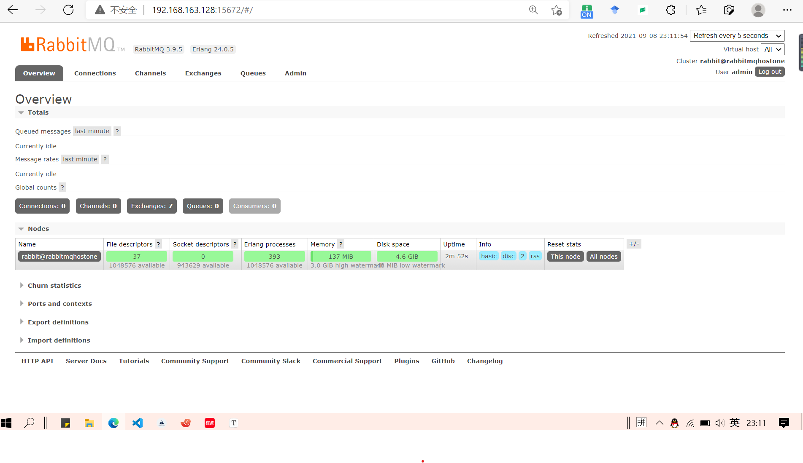

docker安装：

```javascript
docker search rabbitmq:management
```

```javascript
docker pull rabbitmq:management
```

```javascript
docker run -d -p 5672:5672 -p 15672:15672 --name rabbitmq rabbitmq:management
```

```javascript
docker run -d -p 15672:15672  -p  5672:5672  -e RABBITMQ_DEFAULT_USER=admin -e RABBITMQ_DEFAULT_PASS=admin --name rabbitmq --hostname=rabbitmqhostone  rabbitmq:management
```



