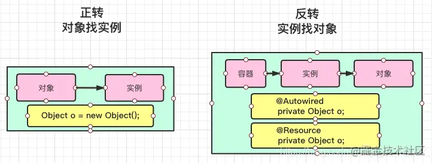
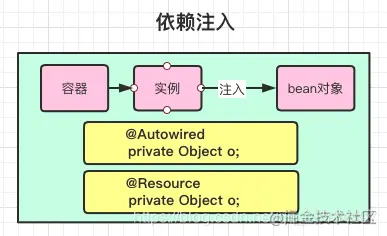
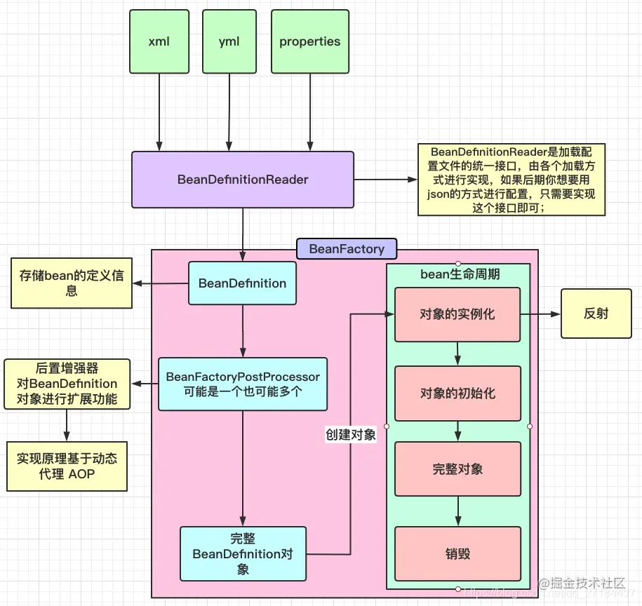
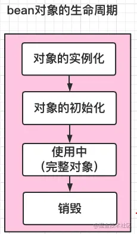
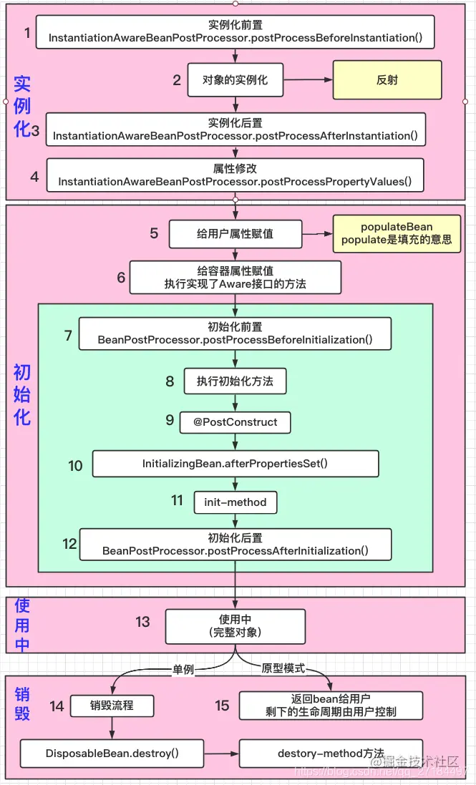
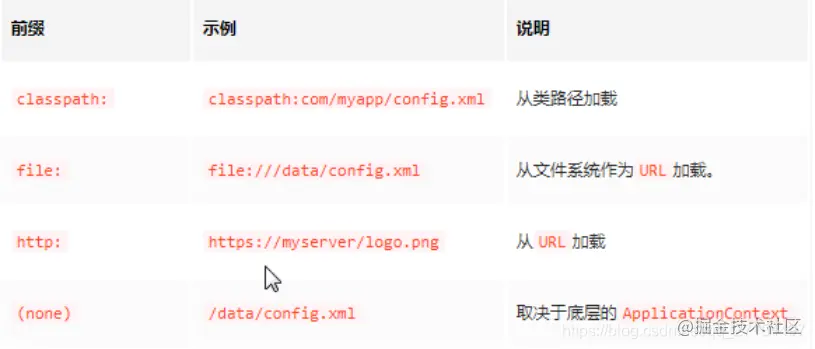
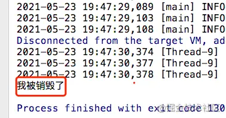

## Spring IOC

首先，在此之前，我们就必须先知道什么是ioc，ioc叫做控制反转，也可以称为依赖注入（DI），实际上依赖注入是ioc的另一种说法，

1.**谁控制谁？**：在以前，对象的创建和销毁都是由用户控制的，用了ioc之后，对象的创建和销毁就都交给容器来控制了，用户就不用管这些，只关注业务需求就好了；


2.**什么是反转？**：既然叫反转，肯定就有正转，正转其实就是对象去找实例，而反转就反过来了嘛，让实例来找对象；怎么找呢？当然是通过容器啦！



3.**谁依赖谁？**：在spring项目中，将对象理解为Bean，也可以叫bean对象，这个bean和容器之间有个依赖关系，bean对象的创建是依赖容器的，就好像孩子依赖父母一样，孩子不能自己生出自己，需要父母的合作才能出生，这里的孩子就是bean，父母就是容器；


4.**谁注入谁？**：通过容器注入了bean对象，而且这个过程是自动化的，也就是说容器会自动找到和bean对象匹配的类型实例注入到对象中；  

## spring ioc的加载过程

了解完控制反转和依赖注入，接下来我们在看看ioc的加载过程，ioc的整个加载过程如下图，先看看大致的流程，然后再慢慢深入 （其中黄色的框内是注释内容）



1、首先，通过BeanDefinitionReader 读取指定的配置文件生成bean的定义信息，然后到完整的bean定义信息(BeanDefinition对象)，注意这里只是存储bean的定义信息，还没有实例化bean对象；就像工厂里面一样，原材料已经准备好了，但是还没有进行生产，原材料就是beanDefinition，生产就是实例化

2、在 `BeanDefinition` 和 完整`BeanDefinition` 中间通过一个后置增强器，可以对bean的定义信息进行统一修改，只需要实现 `BeanFactoryPostProcessor` 接口即可，这个后置增强器是可以有多个的，你只要在不同的类实现多个 `BeanFactoryPostProcessor` 接口就会执行多次，就像这样：

```js
package com.Spring.Boot.init;
import org.springframework.beans.BeansException;
import org.springframework.beans.factory.config.BeanFactoryPostProcessor;
import org.springframework.beans.factory.config.ConfigurableListableBeanFactory;
import org.springframework.stereotype.Component;
/**
 * 扩展方法--后置增强器（可修改bean的定义信息）
 */
@Component
public class ExtBeanFactoryPostProcessor implements BeanFactoryPostProcessor {
    @Override
    public void postProcessBeanFactory(ConfigurableListableBeanFactory beanFactory) throws BeansException {
//        BeanDefinition studentService = beanFactory.getBeanDefinition("studentService");
        System.out.println("扩展方法--可进行修改beanDefinition的定义信息");
    }
}
复制代码
```

3、得到完整`BeanDefinition`之后就可以进行创建对象了，这整个过程被称为 bean 的生命周期，也就是从实例化到销毁的过程；那么这时候爱学习童鞋就要发问了：“对象创建和销毁有这么麻烦嘛？直接反射实例化一个对象不就行了嘛？为啥还有初始化？”； 首先，这是个好问题，来，我们先把掌声送给这位发问的同学；我想说的是，就算是普通的new一个对象出来，里面也会经过实例化和初始化，接下来我们重点讲bean的生命周期; 

## Spring Bean的生命周期

粗略来看，bean的生命周期主要分为以下4个步骤



但其实，它的内部蕴含了很多东西，让我们看看细化后的流程图；



怎么样？ 是不是看到了很多没见过的东西？好像认识几个，但大多都是没见过的东东，不知道不要紧，接下来我们一个个地讲解

 接下来我们要将1、3、4 放到一起讲，是因为它们是在同一个接口里面的，实现`InstantiationAwareBeanPostProcessor`接口即可

```js
package com.Spring.Boot.init;
 
import org.springframework.beans.BeansException;
import org.springframework.beans.factory.config.InstantiationAwareBeanPostProcessor;
import org.springframework.stereotype.Component;
 
@Component
public class MyInstantiationAwareBeanPostProcessor implements InstantiationAwareBeanPostProcessor {
 
    // 实例化前置
    @Override
    public Object postProcessBeforeInstantiation(Class<?> beanClass, String beanName) throws BeansException {
        
        System.out.println("postProcessBeforeInstantiation被调用了----在对象实例化之前调用-----beanName:" + beanName);
        // 默认什么都不做，返回null
        return null;
    }
 
    // 实例化后置
    @Override
    public boolean postProcessAfterInstantiation(Object bean, String beanName) throws BeansException {
        System.out.println("postProcessAfterInstantiation被调用了---------beanName:" + beanName);
        //默认返回true，什么也不做，继续下一步
        return true;
    }
    
    // 属性修改
    @Override
    public PropertyValues postProcessPropertyValues(PropertyValues pvs, PropertyDescriptor[] pds, Object bean, String beanName) throws BeansException {
        System.out.println("postProcessPropertyValues被调用了---------beanName:"+beanName);
        // 此方法可对bean中的属性值进行、添加、修改、删除操作；
        // 对属性值进行修改，如果postProcessAfterInstantiation方法返回false，该方法可能不会被调用，
        return pvs;
    }
}
复制代码
```

下面我们依次解释

## 1、实例化前置

实例化前置使用的是 InstantiationAwareBeanPostProcessor.postProcessBeforeInstantiation(Class<?> beanClass, String beanName) 方法，方法里有2个参数，分别是beanClass和beanName，顾名思义，就是对在对象实例化之前对bean对象的class信息进行修改或者扩展，以达到我们想要的功能，它的底层是动态代理AOP技术实现的；且是bean生命周期中最先执行的方法；

返回非空：返回值是Object类型，这意味着我们可以返回任何类型的值，由于这个时候目标对象还未实例化，所以这个返回值可以用来代替原本该生成对象的目标对象的实例，也就是说，如果返回了非空的值，那么以后我们需要用到这个bean的时候，拿到的就现在返回的对象了，也就不会去走第二步去实例化对象了；

返回空（null）值：默认也是返回null值的，那么就直接返回，接下来会调用doCreateBean方法来实例化对象；

## 2、实例化对象

doCreateBean方法创建实例，用反射技术创建，这个没什么好说的，只是相当于new了一个对象出来而已，但需要注意的是，这个时候只是将对象实例化了，对象内的属性还未设置；

## 3、实例化后置

方法名称： InstantiationAwareBeanPostProcessor.postProcessAfterInstantiation(Object bean, String beanName)

在目标对象实例化之后调用，这个时候对象已经被实例化，但是该实例的属性还未被设置，都是null。因为他的返回值是决定要不要调用postProcessPropertyValues方法中的一个因素(因为还有一个因素是mbd.getDependencyCheck());

返回false ：如果该方法返回false，并且不需要check，那么postProcessPropertyValues就会被忽略不执行；

返回true ： 如果返回true，postProcessPropertyValues就会被执行

## 4、属性修改

方法名称 ：InstantiationAwareBeanPostProcessor.PropertyValues postProcessPropertyValues(PropertyValues pvs, PropertyDescriptor[] pds, Object bean, String beanName)

此方法可对属性值进行修改，修改范围包括添加、修改、删除操作；，如果实例化后置 postProcessAfterInstantiation() 方法返回false，那么该方法不会被调用；

## 5、给用户属性赋值

用户属性指的是用spring 的人自定义的bean对象属性，像 User、Student、Teacher 、UserService、IndexService 这类的对象都是自定义bean对象，第5步主要给这类属性进行赋值操作，使用的是 AbstractAutowireCapableBeanFactory.populateBean() 方法进行赋值；

## 6、给容器属性赋值

容器属性其实就是容器自带的属性，这些属性都是spring本来就有的；可以肯定的是，它们都是 Aware 接口的实现类，主要有以下实现类，我已经将它们的执行顺序都排列好了，


我们先看看怎么用，然后再来讲解每个Aware的作用；上代码

```js
package com.Spring.Boot.init.aware;
 
import org.springframework.beans.BeansException;
import org.springframework.beans.factory.BeanClassLoaderAware;
import org.springframework.beans.factory.BeanFactory;
import org.springframework.beans.factory.BeanFactoryAware;
import org.springframework.beans.factory.BeanNameAware;
import org.springframework.context.*;
import org.springframework.context.annotation.ImportAware;
import org.springframework.context.weaving.LoadTimeWeaverAware;
import org.springframework.core.env.Environment;
import org.springframework.core.io.ResourceLoader;
import org.springframework.core.type.AnnotationMetadata;
import org.springframework.instrument.classloading.LoadTimeWeaver;
import org.springframework.stereotype.Component;
import org.springframework.util.StringValueResolver;
import org.springframework.web.context.ServletContextAware;
import javax.servlet.ServletContext;
 
@Component
public class AllAwareInterface  implements BeanNameAware, BeanClassLoaderAware,
        BeanFactoryAware, EnvironmentAware, EmbeddedValueResolverAware,
        ResourceLoaderAware, ApplicationEventPublisherAware, MessageSourceAware,
        ApplicationContextAware, ServletContextAware, LoadTimeWeaverAware, ImportAware {
 
    @Override
    public void setBeanName(String name) {
        // BeanNameAware作用：让Bean对Name有知觉
        //这个方法只是简单的返回我们当前的beanName,听官方的意思是这个接口更多的使用在spring的框架代码中，实际开发环境应该不建议使用
        System.out.println("1 我是 BeanNameAware 的 setBeanName 方法  ---参数：name，内容："+ name);
    }
    @Override
    public void setBeanClassLoader(ClassLoader classLoader) {
        System.out.println("2 我是 BeanClassLoaderAware 的 setBeanClassLoader 方法");
    }
    @Override
    public void setBeanFactory(BeanFactory beanFactory) throws BeansException {
        // 注意： 如果使用 @Configuration 注解的话，setBeanFactory方法会执行2次，
        System.out.println("3 我是 BeanFactoryAware 的 setBeanFactory 方法");
    }
    @Override
    public void setEnvironment(Environment environment) {
        System.out.println("4 我是 EnvironmentAware 的 setEnvironment 方法");
    }
    @Override
    public void setEmbeddedValueResolver(StringValueResolver stringValueResolver) {
        System.out.println("5 我是 EmbeddedValueResolverAware 的 setEmbeddedValueResolver 方法");
    }
    @Override
    public void setResourceLoader(ResourceLoader resourceLoader) {
        System.out.println("6 我是 ResourceLoaderAware 的 setResourceLoader 方法");
    }
    @Override
    public void setApplicationEventPublisher(ApplicationEventPublisher applicationEventPublisher) {
        System.out.println("7 我是 ApplicationEventPublisherAware 的 setApplicationEventPublisher 方法");
    }
    @Override
    public void setMessageSource(MessageSource messageSource) {
        System.out.println("8 我是 MessageSourceAware 的 setMessageSource 方法");
    }
    @Override
    public void setApplicationContext(ApplicationContext applicationContext) throws BeansException {
        System.out.println("9 我是 ApplicationContextAware 的 setApplicationContext 方法");
    }
    @Override
    public void setServletContext(ServletContext servletContext) {
        System.out.println("10 我是 ServletContextAware 的 setServletContext 方法");
    }
    @Override
    public void setLoadTimeWeaver(LoadTimeWeaver loadTimeWeaver) {
        //LoadTimeWeaver 简称LTW，LTW是AOP的一种实现方式，此方法是为了获取Aop织入的对象，使用的织入方式是：类加载期织入，
        // 一般的aop都是运行期织入，就是在运行的时候才进行织入切面方法，但是LTW是在类加载前就被织入了，也就是class文件在jvm加载之前进行织入切面方法
        // 只有在使用 @EnableLoadTimeWeaving 或者存在 LoadTimeWeaver 实现的 Bean 时才会调用，顺序也很靠后
        System.out.println("11 我是 LoadTimeWeaverAware 的 setLoadTimeWeaver 方法");
    }
    @Override
    public void setImportMetadata(AnnotationMetadata annotationMetadata) {
        //只有被其他配置类 @Import(XX.class) 时才会调用，这个调用对 XX.class 中的所有 @Bean 来说顺序是第 1 的。
        System.out.println("12 我是 ImportAware 的 setImportMetadata 方法");
    }
}
复制代码
```

启动spring后的控制台打印的部分结果如下：


可以看到它们的输出结果按照顺序依次排列打印出来了，这就是它的标准顺序了；接下来我们了解下它们的具体作用

### 6.1 BeanNameAware.setBeanName()

这个方法只是简单的返回我们当前的beanName,听官方的意思是这个接口更多的使用在spring的框架代码中，实际开发环境应该不建议使用

### 6.2 BeanClassLoaderAware.setBeanClassLoader() 

获取Bean的类装载器，

### 6.3 BeanFactoryAware.setBeanFactory()

获取bean工厂，beanFactory让你可以不依赖注入方式，随意的读取IOC容器里面的对象，不过beanFactory本身还是要注入的。

需要注意的是，一般情况下我们都用 @Component 注解，如果使用 @Configuration 注解的话，setBeanFactory方法会执行2次；

### 6.4 EnvironmentAware.setEnvironment()

实现了EnvironmentAware接口重写setEnvironment方法后，在工程启动时可以获得application.properties 、xml、yml 的配置文件配置的属性值。

### 6.5 EmbeddedValueResolverAware.setEmbeddedValueResolver()

通常我们使用@Value注解来获取properties 和 yml 文件中的值，每个类中都要使用@Value也很繁琐，实现EmbeddedValueResolverAware接口后就方便多了。用法也跟@Value一样，需要用${}包裹住；

```js
@Component   
public class PropertiesUtil implements EmbeddedValueResolverAware {
 
	@Override
	public void setEmbeddedValueResolver(StringValueResolver stringValueResolver) {   
     System.out.println(stringValueResolver.resolveStringValue("${logging.file}"));
	}
}
复制代码
```

### 6.6 ResourceLoaderAware.setResourceLoader()

Spring ResourceLoader为我们提供了一个统一的getResource()方法来通过资源路径检索外部资源。从而将资源或文件(例如文本文件、XML文件、属性文件或图像文件)加载到Spring应用程序上下文中的不同实现 ，其实说白了，就是用来加载外部资源的；方法中有个参数：ResourceLoader ，这个参数其实就是ApplicationContext（spring 的上下文对象）；可直接强转；

```js
package org.crazyit.app.service;
import org.springframework.context.ResourceLoaderAware;
import org.springframework.core.io.ResourceLoader;
public class TestBean implements ResourceLoaderAware{
   
    public void setResourceLoader(ResourceLoader resourceLoader) {
        // 可直接强转为 ApplicationContext
        ApplicationContext context = (ApplicationContext) resourceLoader;
 
        System.out.println("6 我是 ResourceLoaderAware 的 setResourceLoader 方法");
    }
   
}
 
复制代码
```

并且我们可以指定不同的前缀来创建路径以从不同位置加载资源



### 6.7 ApplicationEventPublisherAware.setApplicationEventPublisher()；

ApplicationEventPublisherAware是一个事件发布器的接口，使用这个接口，我们自己的 Service 就拥有了发布事件的能力。用户注册后，不再是显示调用其他的业务 Service，而是发布一个用户注册事件。那么在这里是发布事件，那就肯定有监听事件的接口，这个接口叫做 ApplicationListener  ，只要实现 ApplicationListener 接口就可以接受发布的事件了，接下来我们写一个示例来模拟发布事件和监听事件；

先创建一个实体类，用来存储发布的事件内容  StringEvent.java

```js
package com.Spring.Boot.init.listener.eventModel;
import org.springframework.context.ApplicationEvent;
//事件监听对象
public class StringEvent extends ApplicationEvent {
 
    private String str;
    // 构造函数
    public StringEvent(Object source) {
        super(source);
        str = source.toString();
    }
    // 获取字符串
    public String getStr(){
        return str;
    }
}
复制代码
```

创建一个发布事件的类： ExtApplicationEventPublisherAware.java ，实现 ApplicationEventPublisherAware 接口增加发布事件的功能；

```js
package com.Spring.Boot.init.aware;
 
import com.Spring.Boot.init.listener.eventModel.StringEvent;
import org.springframework.context.ApplicationEventPublisher;
import org.springframework.context.ApplicationEventPublisherAware;
import org.springframework.stereotype.Component;
 
/**
 * 发布事件
 */
@Component
public class ExtApplicationEventPublisherAware implements ApplicationEventPublisherAware {
    @Override
    public void setApplicationEventPublisher(ApplicationEventPublisher applicationEventPublisher) {
        System.out.println("发布事件，事件对象为 StringEvent ，内容为 ：1234");
        StringEvent stringEvent = new StringEvent("1234");
        // 发布事件 ，发布后会在 ApplicationListener.onApplicationEvent()方法进行捕获；
        applicationEventPublisher.publishEvent(stringEvent);  // 发布事件
    }
}
复制代码
```

在创建一个事件监听器： EventListener.java ，用来监听所有发布的事件；

```js
package com.Spring.Boot.init.listener;
 
 
import com.Spring.Boot.init.listener.eventModel.StringEvent;
import org.springframework.context.ApplicationEvent;
import org.springframework.context.ApplicationListener;
import org.springframework.stereotype.Component;
 
//事件监听器
@Component
public class EventListener implements ApplicationListener<StringEvent> {
 
    @Override
    public void onApplicationEvent(StringEvent o) {
        System.out.println("监听到事件，内容："+o.getStr());
    }
}
复制代码
```

接下来，运行spring项目，看看打印的结果如下，到这里，事件的发布和监听就完成了；


### 6.8 MessageSourceAware.setMessageSource()

国际化消息通知操作

### 6.9 ApplicationContextAware.setApplicationContext()

ApplicationContextAware 主要用来全局获取 ApplicationContext 上下文，ApplicationContext其实就是容器，为此我们可以实现 ApplicationContextAware 接口来获取ApplicationContext容器对象；我们可以把它做成一个公共的静态类，这样可以在任意地方想拿就拿了，

```js
package com.Spring.Boot.init.aware;
 
import org.springframework.beans.BeansException;
import org.springframework.context.ApplicationContext;
import org.springframework.context.ApplicationContextAware;
import org.springframework.context.annotation.Configuration;
import org.springframework.stereotype.Component;
 
@Component
public class ExtApplicationContextAware implements ApplicationContextAware {
 
    /**
     * Spring容器会在加载完Spring容器后调用ApplicationContextAware.setApplicationContext方法
     * ApplicationContextAware 主要用来全局获取 ApplicationContext 上下文，
     */
 
    private static ApplicationContext applicationContext;
 
    @Override
    public void setApplicationContext(ApplicationContext applicationContext) throws BeansException {
        if (ExtApplicationContextAware.applicationContext == null) {
            ExtApplicationContextAware.applicationContext = applicationContext;
        }
        System.out.println("========ApplicationContext配置成功========");
        System.out.println("========在普通类可以通过调用SpringBootBeanUtil.getApplicationContext()获取applicationContext对象========");
        System.out.println("========applicationContext="+ ExtApplicationContextAware.applicationContext +"========");
    }
 
    /**
     * 获取applicationContext
     * @return
     */
    public static ApplicationContext getApplicationContext() {
        return applicationContext;
    }
 
    /**
     * 通过name获取 Bean.
     * @param name
     * @return
     */
    public static Object getBean(String name) {
        return getApplicationContext().getBean(name);
    }
 
    /**
     * 通过class获取Bean.
     * @param clazz
     * @return
     */
    public static <T> T getBean(Class<T> clazz) {
        return getApplicationContext().getBean(clazz);
    }
 
    /**
     * 通过name,以及Clazz返回指定的Bean
     * @param name
     * @param clazz
     * @return
     */
    public static <T> T getBean(String name, Class<T> clazz) {
        return getApplicationContext().getBean(name, clazz);
    }
 
}
复制代码
```

当然，也可以直接注入，就像这样：

```js
    @Autowired
    private ApplicationContext applicationContext;
复制代码
```

### 6.10 ServletContextAware.setServletContext()

通过实现ServletContextAware接口可获取servletContext，也就是servlet的上下文；

什么是`ServletContext` ： WEB容器在启动时，它会为每个WEB应用程序都创建一个对应的ServletContext对象，它代表当前web应用。ServletConfig对象中维护了ServletContext对象的引用，开发人员在编写servlet时，可以通过ServletConfig.getServletContext方法获得ServletContext对象。

由于一个WEB应用中的所有Servlet共享同一个ServletContext对象，因此Servlet对象之间可以通过ServletContext对象来实现通讯。ServletContext对象通常也被称之为context域对象。

### 6.11 LoadTimeWeaverAware.setLoadTimeWeaver()

其实在调试的时候还有2个没打印出来，第11个就是 LoadTimeWeaver， 简称LTW，LTW是AOP的一种实现方式，此方法是为了获取Aop织入的对象，使用的织入方式是：类加载期织入，一般的aop都是运行期织入，就是在运行的时候才进行织入切面方法，但是LTW是在类加载前就被织入了，也就是class文件在jvm加载之前进行织入切面方法只有在使用 @EnableLoadTimeWeaving 或者存在 LoadTimeWeaver 实现的 Bean 时才会调用，顺序也很靠后;

### 6.12 ImportAware.setImportMetadata() 

还有一个没打印的就是ImportAware接口，这个接口的方法只有被其他配置类 @Import(XX.class) 时才会调用，这个调用对 XX.class 中的所有 @Bean 来说顺序是第 1 的。

## 7、初始化前置

方法名称： BeanPostProcessor.postProcessBeforeInitialization()

在每一个 Bean 初始化之前执行的方法（有多少 Bean 调用多少次）

注意 ： 启用该方法后，标注了@PostConstruct注解的方法会失效

## 8、初始化后置

方法名称： BeanPostProcessor.postProcessAfterInitialization()

在每一个 Bean 初始化之后执行的方法（有多少 Bean 调用多少次）

初始化前置和初始化后置的实现代码如下

```js
package com.Spring.Boot.init;
import org.springframework.beans.BeansException;
import org.springframework.beans.factory.config.BeanPostProcessor;
import org.springframework.stereotype.Component;
 
@Component
public class ExtBeanPostProcessor implements BeanPostProcessor {
    @Override
    public Object postProcessBeforeInitialization(Object bean, String beanName) throws BeansException {
        // 在每一个 Bean 初始化之前执行的方法（有多少 Bean 调用多少次）
        // 注意 ： 启用该方法后，标注了@PostConstruct注解的方法会失效
        System.out.println("初始化前置方法");
        return null;
    }
    @Override
    public Object postProcessAfterInitialization(Object bean, String beanName) throws BeansException {
         在每一个 Bean 初始化之后执行的方法（有多少 Bean 调用多少次）
        System.out.println("初始化后置方法");
        return null;
    }
}

复制代码
```

## 9、执行初始化方法

初始化方法有三个，分别是 添加了@PostConstruct 注解的方法、实现InitializingBean接口、在@bean注解上添加 initMethod属性；我们一个个讲

## 10、初始化方法一：@PostConstruct

在bean对象内添加@PostConstruct 注解后即可实现初始化的功能，被@PostConstruct修饰的方法会在构造函数之后，init()方法之前运行。 有多个则会执行多次；

注意： 如果spring 实现了 BeanPostProcessor接口的postProcessBeforeInitialization() 方法，也就是12的初始后置方法，那么@PostConstruct注解会失效；

代码示例

```js
package com.Spring.Boot.init;
import org.springframework.stereotype.Component;
import javax.annotation.PostConstruct;
 
// @PostConstruct注解
@Component
public class ExtPostConstruct {
 
    /**
     * 被@PostConstruct修饰的方法会在构造函数之后，init()方法之前运行。如果有多个则会执行多次
     * 注意： 如果spring 实现了 BeanPostProcessor接口的postProcessBeforeInitialization方法，该@PostConstruct注解会失效
     */
    @PostConstruct
    public void init() {
        System.out.println("第一个init...");
    }
 
    // 有多个会执行多次
    @PostConstruct
    public void init1() {
        System.out.println("第二个init1...");
    }
 
}

复制代码
```

## 11、InitializingBean.afterPropertiesSet()

spring 初始化方法之一，作用是在BeanFactory完成属性设置之后,执行自定义的初始化行为。

执行顺序：在initMethod之前执行，在@PostConstruct之后执行

代码示例

```
package com.Spring.Boot.init;
import org.springframework.beans.factory.InitializingBean;
import org.springframework.context.annotation.Configuration;
import org.springframework.stereotype.Component;
 
@Component
public class ExtInitializingBean implements InitializingBean {
    @Override
    public void afterPropertiesSet() throws Exception {
        // 一个 InitializingBean 执行一次
        // spring 初始化方法，作用是在BeanFactory完成属性设置之后,执行自定义的  初始化行为.
        // 执行顺序：在initMethod之前执行，在@PostConstruct之后执行
        System.out.println("InitializingBean");
    }
}

复制代码
```

## 12、init-method

bean 配置文件属性 init-method 用于在bean初始化时指定执行方法，用来替代继承 InitializingBean接口,

注意的一点是只有一个类完整的实例被创建出来后，才能走初始化方法。

示例代码，先定义一个类： BeanTest.java ，在类中定义一个初始化方法 initMethod_1()

```js
package com.Spring.Boot.init.bean;
 
public class BeanTest {
    
    // 将要执行的初始化方法
    public void initMethod_1(){
        System.out.println("我是beanTest的init方法");
    }
}

复制代码
```

xml 配置方式

`<bean id="beanTest" class="com.BeanTest" init-method="init"></bean>` 注解配置方式

```js
package com.Spring.Boot.init;
import com.Spring.Boot.init.bean.BeanTest;
import org.springframework.context.annotation.Bean;
import org.springframework.stereotype.Component;
@Component()
public class InitMethod  {
    
    // 在@Bean注解上添加initMethod属性，指向类中的 initMethod_1 执行初始化方法
    @Bean(initMethod = "initMethod_1")
    public BeanTest getBeanTest(){
        return new BeanTest();
    }
}
复制代码
```

## 13、使用中

到这一步，bean对象就已经完全创建好了，是一个完整对象了，并且正在被其他对象使用了；

## 14、销毁流程

在这里需要先说一下，被spring容器管理的bean默认是单例的，默认在类上面有个 @Scope注解，也就是这样的

```js
package com.Spring.Boot.init;
 
import org.springframework.beans.factory.config.ConfigurableBeanFactory;
import org.springframework.context.annotation.Scope;
import org.springframework.stereotype.Component;
 
@Component()
@Scope(value = ConfigurableBeanFactory.SCOPE_SINGLETON)
// @Scope(value = "singleton")  // 也可以这样写
public class InitMethod  {
 
  // methods....
 
}
复制代码
```

如果要设置成多例，只需要把@Scope的属性值改一下就行，就像这样，**多例模式也叫原型模式，它底层不是重新创建一个bean对象出来，而是使用深拷贝技术实现的，就是复制一个对象出来进行使用**

```js
@Scope(value = ConfigurableBeanFactory.SCOPE_PROTOTYPE)
// @Scope(value = "prototype") // 也可以这样写
复制代码
```

为什么要介绍单例和多例呢？ 因为啊，销毁流程的走向就跟你是单例还是多例有关；

如果是单例模式，会先执行 DisposableBean.destroy()方法，然后在执行 destroy-Method 方法；

### 14.1 DisposableBean.destroy()

单例模式的销毁方式，示例代码

```js
package com.Spring.Boot.init.destroy;
 
import org.springframework.beans.factory.DisposableBean;
import org.springframework.stereotype.Component;
 
/**
 * 销毁方法
 */
@Component
public class ExtDisposableBean implements DisposableBean {
    @Override
    public void destroy() throws Exception {
        System.out.println("我被销毁了");
    }
}
复制代码
```

当结束main方法时，控制台打印的结果如下



### 14.2 destory-method方法

还是拿 第11 个流程的例子来讲，只不过这次我们在@Bean注解里加上 destroyMethod属性，指向销毁方法 ：destroyMethod_1()

```js
package com.Spring.Boot.init;
 
import com.Spring.Boot.init.bean.BeanTest;
import org.springframework.context.annotation.Bean;
import org.springframework.stereotype.Component;
 
@Component()
public class InitMethod  {
 
    // 在@Bean注解上添加initMethod属性，指向类中的 initMethod_1 执行初始化方法
    // 在@Bean注解上添加destroyMethod属性，指向类中的 destroyMethod_1 执行销毁方法
    @Bean(initMethod = "initMethod_1",destroyMethod = "destroyMethod_1")
    public BeanTest getBeanTest(){
        return new BeanTest();
    }
}
BeanTest.java

package com.Spring.Boot.init.bean;
 
public class BeanTest {
 
    // 将要执行的初始化方法
    public void initMethod_1(){
        System.out.println("我是beanTest的init方法");
    }
 
    // 将要执行的销毁方法
    public void destroyMethod_1(){
        System.out.println("我是beanTest的init方法");
    }
 
 
}
复制代码
```

xml的配置方式 

```
<bean id="beanTest" class="com.BeanTest" destroy-method="destroyMethod_1"></bean>
```

## 15、返回bean给用户，剩下的生命周期由用户控制

因为多例模式下，spring无法进行管理，所以将生命周期交给用户控制，用户用完bean对象后，java垃圾处理器会自动将无用的对象进行回收操作； 


作者：Java架构师
链接：https://juejin.cn/post/6966158157202587662
来源：稀土掘金
著作权归作者所有。商业转载请联系作者获得授权，非商业转载请注明出处。